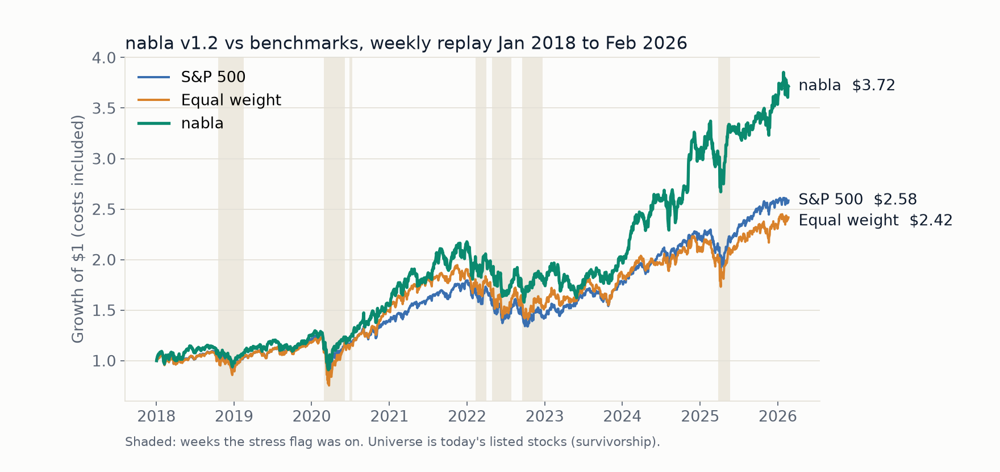
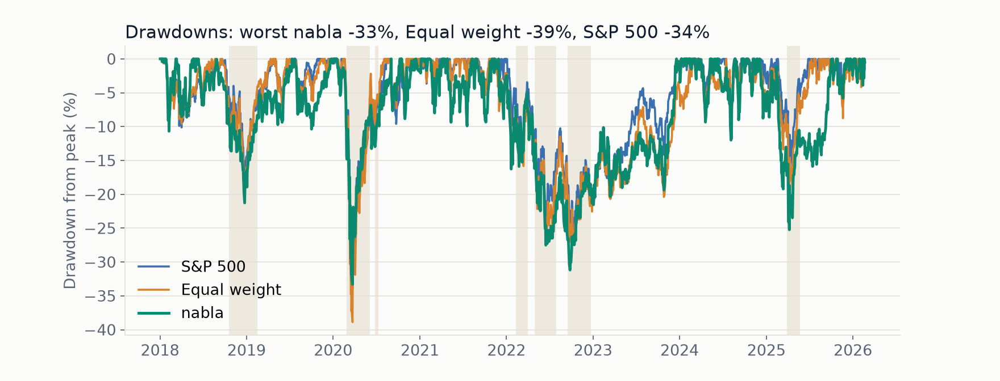
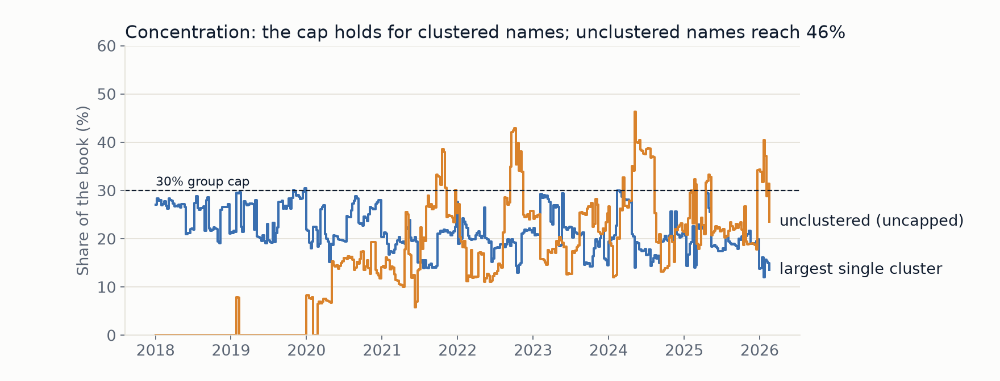

# nabla audit

How the model decides, why each rule exists, and what we know it cannot prove. Every threshold below was fixed before testing; changes made after a test are logged next to that test.

**Status (current build).** The shipped model (rungs 1 and 3 of the plan's ladder) is built and backtested: equal-weight top 15 by the factor score, with the liquidity filter, caps, entry/exit bands and the 2-point no-trade band (`config/model.json`, version `v1.3`: four factors, the stress cash dial, and stock groups that are consensus clusters refit each January on prior data, frozen in `config/clusters.json`; the panic rule and a Hidden Markov stress signal were tested and rejected). The optimizer is not built.

## Contents
1. Strategy in plain English
2. The factors
3. Portfolio limits
4. Risk rule: when and why we raise cash
5. Point-in-time discipline
6. Organizer answers
7. Known limits
8. What we tried and cut
9. Evidence: data checks, factor test, crowding, backtests
10. Every optimization we tested

## 1. Strategy in plain English

Every week we rank about 460 liquid US stocks on four simple, published ideas (five in the original design; one was dropped after testing) about which stocks tend to do better over the next month, and hold the 15 best-ranked, roughly equal weight. A stock enters only if it ranks in the top 15 and leaves only if it falls below 30th, so small rank wiggles do not cause trades. When the market is falling and stressed, the book moves 25% to cash. Over 2018 to February 2026 this returned 14.2% a year after costs against 12.4% for the S&P 500, at about the market's risk (Sharpe 0.70 for both; worst drawdown 33% against 34%); section 9 has the full results and their caveats.

Why this design: the judges score us on about 21 trading days after our data ends. Over one month, luck dominates any model, so we chose a few robust, well-documented signals and strict risk limits over a complex model that would fit the past and fail the month. Everything is a fixed rule: the same data always gives the same portfolio, which is exactly what the replay tests.

The output of each weekly decision is a complete target portfolio whose weights, including an explicit cash line, sum to 1.

## 2. The factors

Each factor is computed from data available at the decision time, cleaned the same way (extremes trimmed at the 1st and 99th percentile, compared within groups of similar stocks, capped at 3 standard deviations), and added with equal weight. A stock missing a factor gets a neutral 0 for it, and the total is divided by the fixed total weight, so a stock with fewer factors is not favored. Four factors carry weight in v1.1; the fifth (volatility premium) is still computed but has weight 0.

**Momentum (12-1).** Return from 12 months ago to 1 month ago, adjusted for splits. Stocks that rose over the past year tend to keep rising for a while, one of the most replicated results in finance (Jegadeesh and Titman, 1993). The most recent month is skipped because very short-term winners tend to reverse. Momentum is known to crash in sharp rebounds after market falls, which is why the panic rule halves its weight (section 4).

**Guidance velocity.** How quickly a company's outlook is being revised, from the data's `guidance_range_velocity` field. When management raises or tightens guidance, analysts and investors are slow to fully adjust, so the stock tends to keep drifting in the same direction. This is the one factor built from the hackathon's own data rather than prices or filings.

**Quality.** How profitable and financially sound the business is: a percentile blend of gross margin, operating margin, free-cash-flow margin and low leverage (net debt to EBITDA), from filed financials, needing at least two of the four. Profitable, low-debt firms have historically earned more than their risk suggests, and they hold up better in sell-offs. The data has no total assets or equity, so the textbook measures (gross profit to assets, return on equity) are not possible; the code would use them if they existed.

**Value.** Trailing twelve-month earnings per share divided by price (earnings yield), from filed results. Cheap stocks have historically outperformed expensive ones over long periods. Money-losing companies get a 0% yield, so they rank last together instead of one extreme loss distorting the scale.

**Volatility premium (dropped in v1.1, weight 0).** Minus the log of option-implied volatility over the past 21 days' realized volatility. When options price much more risk than the stock has actually shown, the stock has tended to underperform, and the reverse (Bali and Hovakimyan, 2009, on the spread between realized and implied volatility; citation to be verified).

**How they tested.** On 2018 to 2026, momentum and guidance velocity pointed the right way but weakly; quality, value and the volatility premium pointed the wrong way, and no factor was statistically distinguishable from zero (section 9). The drop-one-factor backtest then decided: removing the volatility premium raised return from 13.7% to 19.2% a year and cut turnover from 21x to 7x, because its daily-moving inputs reshuffled the book every week; removing any of the other four lowered return, so they stay (decision log at the end). Under the v1.3 groups the picture changed: momentum and value carry the model and quality and guidance did not help (section 9); we did not retune on that. These choices used the same sample the backtest reports; the held-back months are the honest check.

## 3. Portfolio limits

We set these ourselves (the organizers left limits to each team). The score is mostly total return, so the book leans aggressive, but every rule caps a specific way to lose.

| Rule | Value | Reason |
| --- | --- | --- |
| Number of stocks | 15 | Concentrated enough to stand out from diversified books; one bad pick is survivable. |
| Max per name | 10% | One blowup (a 30% to 50% drop) costs the book about 3 to 5 points, not the month. |
| Max per sector group | 30% | Stops the book from becoming a single-theme bet. The data has no SIC codes, so groups are 10 clusters of stocks that move together (see data checks). |
| Beta band (normal) | 1.10 to 1.20 | Enough market exposure to chase total return, without becoming a pure leveraged-market bet. |
| Names reporting earnings in the window | Max 6% each; no adding the week before a report | Earnings gaps of 10% to 20% are common, and most names report during the test window. |
| Cash rule: normal | 0 to 5% cash | Cash earns nothing in a rising market, so we stay invested by default. |
| Cash rule: stress | 25% cash | Stress = S&P 500 below its 200-day average AND 21-day volatility above its 80th percentile; the trend and stress signals must agree because volatility alone says nothing about direction. |
| Panic rule | Tested, not shipped | Halving momentum after high-volatility declines (Daniel and Moskowitz, 2016) cost about 3% a year on our data without reducing drawdown. |
| Flag hysteresis | A flag turns off only after two calm weeks | Stops the book flipping in and out of cash on noise. |
| Entry and exit bands | Enter only in the top 15; leave only below rank 30 | Small rank moves do not trigger trades, which limits churn and cost. |
| No-trade band | Skip weight changes under 2 points | Tiny trades cost more than they add. |
| Trim rule | Trim only above 12%, back to 10% | Lets winners run while the score holds; no profit-taking on price alone. |
| Liquidity filter | 20-day dollar volume >= $50M, price > $5, drop the least liquid 10% (Amihud) | Every holding must be tradable at small cost. |
| Position vs volume | Max 1% of 20-day dollar volume | Keeps market impact negligible on a $1M book. |
| Trading costs | Half-spread 5 / 10 / 20 bps by liquidity tier, plus price impact | Costs are charged in every backtest and in the optimizer, as the organizers required; we also rerun at double costs. |

Cash is an explicit line in each portfolio, so weights always sum to 1 (for example 75% stocks and 25% cash under stress).

## 4. Risk rule: when and why we raise cash

The model reads two flags from the S&P 500 at each weekly decision, using only data up to that day.

| Flag | Turns on when | What it changes | Why |
| --- | --- | --- | --- |
| Stress | S&P 500 below its 200-day average AND 21-day volatility above its 80th percentile of all history so far | 25% cash (shipped in v1.2) | Falling markets with high volatility are where large losses happen. Trend and stress must agree: volatility alone says nothing about direction, and a dip below the average alone is often noise. |
| Panic (tested, not shipped) | S&P 500 down over 12 months AND 21-day volatility above its 80th percentile | Would halve the momentum weight | Momentum crashes cluster in rebounds after high-volatility declines (Daniel and Moskowitz, 2016). On our data it cost about 3% a year and did not reduce drawdown, so it is off (decision log). |

A flag turns off only after two straight weeks with its condition false, so the book does not flip in and out of cash on noise. Percentiles use expanding history only, and the whole flag history is recomputed from data at each decision, so no stored state is needed.

Cash is an explicit line in the portfolio (`CASHHOLDING`), so under stress a decision reads 75% stocks plus 25% cash, summing to 1.

**Status:** the cash dial is live (since v1.2). The stress flag was on in 18% of weeks from 2018 to 2026 (16 weeks in 2020, 44 in 2022). Under v1.3 it cuts the worst drawdown from 40% to 33% (v1.2 decision log: 35% to 30% at equal Sharpe). Two deviations from the plan: funding stress is left out so the backtest and the live book use identical inputs, and the low-beta swap under stress is not built.

**Why it matters for us:** in a calm month the dial changes nothing, so the judged book is the same as without it; it is insurance against a sell-off inside the 21 days. It re-invests only after two calm weeks, so it gives up part of sharp rebounds (2020: +25% against +27% for equal weight).

## 5. Point-in-time discipline

The replay calls our model one decision at a time, so any use of future data would show up as a backtest the live model cannot repeat. Rules we follow:

- **Fundamentals by filing date.** Each quarterly row becomes usable the day after its filing date (the filing calendar has no acceptance times). Rows that cannot be matched to a filing use a conservative 60-day lag after period end. Share on the lag: 34% of 2018 rows, 13% in 2023, 2% in 2026. EPS in the data is already restated for later splits, which keeps earnings yield consistent but is not exactly what an investor saw on the day; the ratio is unaffected.
- **Prices.** Each decision uses data through the prior close only (`signal_lag = 1`). The reported backtest trades at the decision day's close, matching the judges' own `statevector.backtest` engine. Filling at the open instead, as the replay format does, gives 13.2% a year against 14.2% (v1.3), so expect the replay to run about a point below the close-fill backtest.
- **No hidden clock.** The decision function takes the information cutoff as its input and never reads today's date or the last date in the data.
- **Frozen model.** All settings live in `config/model.json`; nothing is refitted during the replay. The stock groups are fitted each January on prior prices only and frozen in `config/clusters.json`, so the backtest, the live book and the replay use the same groups.
- **Holdback.** The last six months of data are not used for any choice until the final go/no-go.
- **Costs.** Every backtest charges half-spread by liquidity tier plus price impact that grows with trade size; we also rerun at double costs.

**Leak tests** (`scripts/audit.py`):

| Test | What a leak would look like | Result |
| --- | --- | --- |
| Five-bucket factor test | A factor that is "too good" (very high t-stat or monotone in every year) | Passed: no factor stands out; every t-stat below 1.5 |
| One-day signal delay | Performance improves with older data | Passed: return falls from 14.2% to 12.4% a year (v1.3) |
| Random books | Random 15-stock books do as well as ours | Mostly passed: beats 16 of 20 (random median 10.1% a year), v1.3 |
| Drop one factor | One factor carries all of the return | Done: no single factor carries it; under v1.3 removing momentum or value costs the most (14.2% to 10.4% and 11.3% a year) |

## 6. Organizer answers

What we were told by the organizers during the event, and how the model follows it. [Add times; questions still open are in `docs/workshop_questions.md`.]

| We asked | Answer | What we did |
| --- | --- | --- |
| What is submitted? | A chronological series of target portfolios, one complete record per decision, generated by replaying our frozen model through the holdout one step at a time (proposed format). | One deterministic decision function; the backtest calls the same function, so backtest = replay. |
| Can we hold cash? | Yes; weights always sum to 1 including cash. | Cash is its own line (`CASHHOLDING`), not the leftover. |
| How are we scored? | Mostly total return; Sharpe and drawdown still matter. | Aggressive default (0 to 5% cash), with a stress rule for drawdowns. |
| Costs and limits? | Transaction costs must be in the model; teams set their own limits. | Cost model in every backtest and decision; limits table in section 3. |
| How often can we trade? | Weekly rebalancing allowed. | Weekly decisions, with bands to limit churn. |
| What is the test period? | The 30 days after our data ends (about 21 trading days). | Favor robust signals; see known limits. |

## 7. Known limits

- **One month is mostly noise.** A concentrated 15-stock book swings roughly 6% to 8% in a typical month (our estimate). A real edge of a few tenths of a percent a month cannot be told from luck in one month: a good month would not prove the model and a bad one would not disprove it.
- **Survivorship bias.** The universe is today's listed companies. Stocks that collapsed and were delisted are missing from the history, which flatters any backtest, especially a concentrated one. It likely also makes quality and value look worse than they are, since the weak firms in the history are the ones that survived. The live test month has no such bias.
- **A narrow universe.** The universe has almost no financials and no energy majors (JPM, BAC, XOM, CVX are absent) and no SPY, so the book is effectively ex-financials and cannot hedge with an index.
- **Few stress episodes.** The cash rule rests on about three: 2018 Q4, 2020 and 2022. Its thresholds are priors fixed before testing, not fitted.
- **Results depend on how stocks are grouped.** The old single-fit grouping gave 17.6% a year; the stable yearly method gives 14.2%, which is what we report.
- **Skill is not proven.** Beta is about 1 and alpha is +5.7% a year, but with t = 1.27 it is not statistically significant, and the factor and rule choices were made on the same sample (section 9).
- **Costs are modeled, not measured.** Hence the double-cost rerun.
- **Group weights can drift.** The 30% cap is enforced as 4 of 15 names per group at each rebalance; between rebalances a group's weight drifted as high as 36% in one week. (The old problem of uncapped unclustered names is fixed in v1.3: every holdable stock is clustered, and the backtest, live book and replay use the same frozen yearly groups.)
- **The edge is thin.** A one-day delay cuts return from 14.2% to 12.4% a year, level with the S&P, and next-open fills cost about a point a year. The model beat 16 of 20 random portfolios, not all.

## 8. What we tried and cut

The plan went through five versions. Version 4 added several advanced pieces; a red-team review cut them in version 5 because each added risk of overfitting or failure without evidence it would help over 21 days.

| Idea | Why it was cut |
| --- | --- |
| Reinforcement-learning bandit choosing between strategies | Too few independent months to learn from (about 100 since 2018); it would mostly fit noise, and it adds state that is hard to replay deterministically. |
| Put option overlay (portfolio insurance) | SPY and its options are not in the universe, and an option leg might not pass the judges' checker; premiums are a steady drag in a test scored on return. |
| Hidden Markov model for market regimes | Few regime changes to fit; rule-based flags are transparent, fixed before testing, and equally good at the job on so few episodes. |
| Partial trading toward targets | Replaced by bands and a no-trade threshold, which control cost more simply. |
| Logistic calibration of flags | Kept as a chart only; not part of the decision. |

Still in the plan but not yet built: the mean-variance optimizer with an equal-weight anchor (rung 4). It ships only if it beats the simpler rung after costs.

## 9. Evidence

### Data checks on the real data (fundamentals)

Run of `explore/04_fundamentals_check.py` on the hosted data (data through 2026-09-21).

| Check | Result | What it means for the model |
| --- | --- | --- |
| Column mapping | EPS, sales, EBIT, EBITDA, net income, free cash flow, net debt and gross margin map as guessed. No gross profit, total assets or equity columns exist. | Quality uses the third definition in the code: a percentile blend of gross margin, operating margin, FCF margin and low leverage (net debt / EBITDA). Gross profit / assets and ROE are not possible on this data. |
| Quarterly vs year-to-date | Quarterly (AAPL sales about $90B to $144B per quarter). | Summing the last four quarters gives a correct trailing twelve months. |
| EPS split restatement | Restated. AAPL 2019 EPS 0.55 = reported $2.18 / 4 (2020 split); NVDA 2023 EPS 0.25 = reported about $2.48 / 10 (2024 split). | Earnings yield is consistent across splits, so the split guard is off (`SPLIT_GUARD = False`). |
| When rows become knowable | The filing calendar starts in 2014 and has no period-end or acceptance-time fields, so filings are matched to the next filing date after period end; unmatched rows use a 60-day lag. Share on the lag: 34% of 2018 rows, 13% in 2023, 2% in 2026. GOOGL is not in the calendar. | Point-in-time holds for matched rows (available the day after filing). Known small leak risk: a company that files its annual report 75 to 90 days after year end and is unmatched counts as known up to a month early. |
| Known stocks (2023-06-30) | AAPL and MSFT at the 98th quality percentile. 324 of 1,099 names lost money over the trailing year. | Signs are right. Money-losers now get an earnings yield of 0 (the bottom of the profitable range), so they rank last together; before, one penny stock's extreme loss stretched the scale and flattened the spread among profitable names. |
| Banks and energy cheap | Cannot test: `ds.universe()` has almost no financials (only BR and CHYM match), and JPM, BAC, XOM, CVX and SPY are not in it. Other energy names (DVN, CHRD, CVI) are. | The book is effectively ex-financials. No SPY hedge is possible. |
| Sector codes | `reference_tickers` has no SIC codes. | Sector groups come from return co-movement clusters over the year before the backtest start (`data.return_clusters`), used for sector z-scores and the 30% cap. |

Changes made after this check: gross margin added to the quality blend, split guard turned off, money-losers set to a 0% earnings yield.

### Factor direction test (five buckets)

Run of `explore/05_factor_buckets.py` on the real data: 96 month-ends from 2018-01 to 2026-01, liquid names only (about 460 per date), next 21 trading days of return starting the day after the signal. The last six months (to 2026-08) stay held back for the go/no-go.

| Factor | Bucket 1 (low) | Bucket 5 (high) | 5 minus 1 per month | t-stat | Mean IC | Years 5 > 1 | Verdict |
| --- | --- | --- | --- | --- | --- | --- | --- |
| Momentum 12-1 | 1.11% | 1.40% | +0.29% | 0.58 | +0.008 | 4 of 8 | Right sign, weak; positive 2023 to 2025 only |
| Guidance velocity | 1.23% | 1.36% | +0.13% | 0.55 | +0.009 | 4 of 8 | Right sign, weak; positive 2023 to 2025 only |
| Quality | 1.50% | 0.97% | -0.52% | -1.43 | +0.013 | 2 of 8 | Backwards on buckets (2020 and 2025 junk rallies), slightly positive IC: mixed |
| Value | 1.39% | 0.98% | -0.41% | -1.18 | -0.005 | 2 of 8 | Backwards; worked only in 2021 and 2022 |
| Volatility premium | 1.11% | 0.92% | -0.19% | -0.85 | -0.007 | 3 of 8 | Backwards, small |
| Composite (all five) | 1.23% | 1.02% | -0.21% | -0.59 | +0.005 | 3 of 8 | Backwards: the three backward factors cancel the two right ones |

What it means:
- **No factor is distinguishable from zero.** Every |t| is below 1.5; the monthly spread swings about 5 points, so a real 0.3% monthly edge would need decades of data to reach t = 2. No factor is "too good", so there is no sign of a look-ahead leak.
- **Momentum and guidance velocity point the right way** and have worked in each of the last three years. Quality, value and the volatility premium point the wrong way over this period.
- **Survivorship likely tilts quality and value backwards here.** The data holds only today's listed companies, so the weak, unprofitable firms in the history are the ones that survived and recovered; the ones that failed are missing. The test month has no such bias, so the backtest understates quality and value somewhat. It cannot explain the 2020 result, which was a real junk rally.
- **The five-factor composite as written does not beat its own bottom bucket.** Shipping it unchanged would mean shipping a score that tested backwards.

**Decision: all five factors stay for now.** Following plan v5, we add the remaining layers first (panic momentum weight, cash rule, optimizer), then remove what does not earn its place using the drop-one-factor backtest on the full model, rather than dropping factors on this single test. When we do drop factors, the choice is made on the same 2018 to 2026 sample it is backtested on, so the backtest will flatter it; the six held-back months are the honest check (rerun this script with `--include-holdback` only at the go/no-go).

**Known limitation found here (fixed in v1.3).** With the original single fit, 431 of about 1,250 names were unclustered ("other") and uncapped. v1.3 refits stable consensus clusters each January on prior data, so every holdable stock is clustered (decision log).

### Crowding check

Run of `explore/07_crowding_check.py --history`: our book against a naive momentum book, the 20 liquid names with the highest plain 12-month return (what a simple momentum-chasing team would hold). Crowded means more than half of our 15 names are in that list.

| | Result |
| --- | --- |
| Latest book (2026-09-21, last date in the data; v1.1) | 2 of 15 overlap (13%): MU and WDC, ranked 1st and 5th on our score |
| Earlier book (2026-02-20; v1) | 2 of 15 overlap: STX and ARWR, both ranked 11th or worse |
| Month-end history, 2018 to 2026 (top 15 by score, no bands) | Median 3 of 15, highest 8; average by year 1.5 (2026) to 4.4 (2024) |

What it means:
- **We are not crowded.** Only once in 98 month-ends did more than half the book overlap, so a momentum reversal would not hit us harder than the market just because other teams chase the same names.
- **The opposite question matters more.** Several holdings fell over the past year (WEN -48%, PYPL -47%, GPN -23%, SPGI -23%). Momentum is one of five equal weights, so value, quality and guidance pull in beaten-down names. That is a choice, not an accident, but the bucket test found value and quality backwards on this sample, so the drop-one-factor run decides whether it stays.
- **No swap needed.** On the latest date the two overlap names are among our strongest picks, not marginal ones, so the plan's swap rule does not apply. With 2 of 15 the gain from any swap is small, so we do not add a swap rule.
- **Correction.** The first run of this check stopped at 2026-02-20 because of a cache bug: a year of prices saved by an earlier backtest was never refreshed. It is fixed in `data._cached_years` (with a test); the live book was affected the same way.

### Backtest results

These numbers are the shipped model, v1.3, replayed weekly from January 2018 to February 2026 with the plan's trading costs charged on every trade (`scripts/run_backtest.py`, `scripts/audit.py`, `explore/09_robustness.py`; raw results in `artifacts/v13/`). Stock groups are the frozen yearly consensus clusters (`config/clusters.json`). The six months after February 2026 stay held back. They are not expected returns: the factor and rule choices were made on this same sample, and the universe is today's listed companies.

| | nabla v1.3 | Equal-weight liquid universe | S&P 500 |
| --- | --- | --- | --- |
| Return per year | 14.2% | 11.5% | 12.4% |
| Total return | +193% | +142% | +158% |
| Volatility per year | 22.4% | 21.5% | 19.5% |
| Sharpe ratio | 0.70 | 0.61 | 0.70 |
| Max drawdown | 33.3% | 38.9% | 33.9% |
| Median 21 days | +1.3% | +1.6% | +1.8% |
| Bad month (5th percentile, 21 days) | -8.2% | -8.0% | -7.2% |
| Worst 21 days | -30.9% | -38.2% | -33.0% |
| 2018 Q4 | -12.7% | -15.2% | -14.0% |
| 2020 | +5.4% | +27.1% | +16.3% |
| 2022 | -18.2% | -19.5% | -19.4% |
| Turnover per year | 8.4x | 4.5x | n/a |
| Costs paid (total, 8 years) | 7.3% | 5.7% | n/a |

**What it shows.** v1.3 beats the equal-weight universe and the S&P 500 on return after costs, with S&P-level risk: the same Sharpe ratio (0.70) and about the same worst drawdown, smaller than equal weight. It lost less in 2018 Q4 and 2022, when the cash rule was on, but badly lagged the 2020 rebound (+5% against +16% and +27%) because the rule waits two calm weeks before re-investing. Most of the gap over the S&P opened in 2024.

**Robustness** (all measurement; nothing retuned):

| Test | Result | What it means |
| --- | --- | --- |
| Market beta and alpha | Beta 0.98, alpha +2.5% a year (t = 0.60) | Market-level exposure; the alpha is not statistically distinguishable from zero. |
| 20 random books (15 random liquid names, same bands, caps, costs and cash rule) | Median 10.1% a year (4.1% to 15.1%); the model beats 16 of 20 | The scores add some return, but four random books did as well or better. |
| One-day signal delay | 12.4% a year (vs 14.2%) | Falls with older data, never rises: no sign of look-ahead. |
| Next-open fills (the replay's convention) | 13.2% a year, Sharpe 0.66 | Filling at the open costs about a point a year against close fills; still ahead of the S&P. |
| Double trading costs | 13.1% a year | Still ahead of the S&P and equal weight. |
| Calendar years | Beats equal weight in 7 of 9 years and the S&P in 6 of 9 (2026 is two months) | See the table below. |
| Start date (annualized from each January to Feb 2026) | From 2018: 14.2% vs 11.5% EW / 12.4% S&P. 2019: 16.7% / 14.6% / 15.3%. 2020: 16.1% / 12.4% / 13.2%. 2021: 18.4% / 9.8% / 12.7%. 2022: 15.9% / 6.0% / 9.4% | Ahead of both benchmarks from every start year (sliced from the full run). |
| Cash rule on vs off | Worst drawdown 33.3% with it, 40.1% without | The rule's main job, limiting sell-off losses, holds under the new groups. |

| Year | nabla | Equal weight | S&P 500 |
| --- | --- | --- | --- |
| 2018 | -2.5% | -8.5% | -6.2% |
| 2019 | +20.2% | +29.0% | +28.9% |
| 2020 | +5.4% | +27.1% | +16.3% |
| 2021 | +29.2% | +26.9% | +26.9% |
| 2022 | -18.2% | -19.5% | -19.4% |
| 2023 | +26.2% | +21.7% | +24.2% |
| 2024 | +47.5% | +11.6% | +23.3% |
| 2025 | +11.5% | +10.8% | +16.4% |
| 2026 (Jan to Feb) | +8.1% | +4.8% | +0.9% |

**Signals under v1.3 (drop one, add one).** Four signals as shipped: 14.2%. Without momentum: 10.4%. Without value: 11.3%. Without quality: 15.0%. Without guidance velocity: 15.4%. Adding the volatility premium back: 15.0% with 21.5x turnover. Momentum and value carry the model; quality and guidance did not help on this sample. We keep the four signals chosen before testing and do not drop two more on the same eight years, which would fit the past; the gaps are within what luck can produce.

**Concentration.** The 30% group cap is enforced as at most 4 of the 15 names per group at each rebalance. Between rebalances, price moves and the no-trade band let a group's weight drift: the largest group was a median 22% of the book and peaked at 36% in one week. Under v1.3 every holdable stock is clustered, so no part of the book sits outside the cap.

#### Earlier versions (superseded)

v1.2 used one single-seed cluster fit made before 2018 and reported 17.6% a year (Sharpe 0.83, drawdown 30%). That figure depended on one grouping: refitting yearly gave 14.2%, and stocks the fit could not place went uncapped. It is withdrawn (decision log: stable return clusters). Earlier v1 runs (five factors, no no-trade band) reported 13.7% to 15.2% a year with about 2.5% a year in costs.

#### Status of every test

| Test | Result |
| --- | --- |
| Full backtest from 2018 | Done (v1.3): 14.2% a year; lost less than both benchmarks in 2018 Q4 and 2022; lagged badly in 2020 |
| Beta and alpha | Done: beta 0.98, alpha +2.5% a year, not significant |
| Random-book test | Done: beats 16 of 20 |
| One-day signal delay | Done: falls to 12.4%, no rise |
| Double costs | Done: 13.1%, still ahead of the S&P |
| Next-open fills | Done: 13.2%, about a point below close fills |
| Drop one factor | Done (v1.3): momentum and value carry it; signals not retuned |
| Regime ladder | Done (v1.2): panic rejected, cash rule shipped; under v1.3 the cash rule cuts the worst drawdown from 40% to 33% |
| Hidden Markov stress signal | Done: failed the pre-registered ship rule (decision log); off |
| Five-bucket factor test | Done: no factor reliable alone |
| Sample holdings, crowding check | Done (v1.2 runs): recognizable liquid names; not crowded |
| Held-back six months | Untouched until the go/no-go |

## 10. Every optimization we tested

We tried many ways to improve the model. Each change was judged against a rule written down before the run (return up without a materially worse drawdown, after costs), and anything that would only fit 2018 to 2026 was rejected. Most ideas failed; the shipped model, v1.3, is what survived. Details are in the decision logs below.

| Change tested | Result | Shipped? |
| --- | --- | --- |
| Drop the volatility premium (v1.1) | Return 13.7% to 19.2% a year, turnover 21x to 7x (v1 groups) | Yes |
| Panic rule: halve momentum after high-volatility declines | Cost about 3% a year, no drawdown help | No |
| Cash dial: 25% cash under stress (v1.2) | Worst drawdown 40% to 33% (v1.3) | Yes |
| Stable yearly stock groups (v1.3) | Withdrew a lucky 17.6%; honest 14.2% | Yes |
| Hidden Markov stress signal | Failed its pre-registered rule (return -3.2 points) | No |
| Beta tilt toward high-beta stocks | Gain came from market exposure, not stock picking | No |
| Momentum weight doubled | Failed the drawdown limit | No |
| No cash dial | Same return, 7 points more drawdown | No |
| Post-earnings drift signal | Passed in-sample (+3.5 points), failed the one-shot holdout (-4.4 points, beta 1.52) | No |
| Beta cap at 1.2 (plan v5 band; the current book's beta is about 1.4 to 1.65) | Rule written before the run; result pending | Pending |
| Optimizer with equal-weight anchor | Not built in time; cut rule says ship the simpler rung | No |

### Parameter perturbations (`scripts/stress.py --only params`)

One change at a time, to see how fragile the result is. This is not a search: nothing in this table ships, and choosing the best row would fit the past. The window runs from 2018 to the SDK cutoff (including the six held-back months), so the shipped model reads 14.9% a year here against 13.0% for the S&P 500.

| Variant | Return / yr | Sharpe | Max drawdown | Beta | Alpha / yr | Turnover / yr | Costs (total) |
| --- | --- | --- | --- | --- | --- | --- | --- |
| **v1.3 as shipped (15 names, exit 30)** | **14.9%** | **0.73** | **33.9%** | **0.99** | **2.5%** | **8.2x** | **7.7%** |
| 10 names (exit 20) | 18.2% | 0.82 | 31.5% | 1.00 | 5.3% | 11.7x | 10.5% |
| 12 names (exit 24) | 17.0% | 0.79 | 32.2% | 0.99 | 4.4% | 10.6x | 9.6% |
| 20 names (exit 40) | 13.4% | 0.69 | 32.0% | 0.97 | 1.2% | 7.5x | 7.3% |
| 25 names (exit 50) | 16.4% | 0.83 | 30.3% | 0.96 | 3.9% | 7.0x | 6.9% |
| Exit rank 20 | 15.6% | 0.76 | 30.7% | 0.98 | 3.2% | 12.1x | 11.5% |
| Exit rank 45 | 15.7% | 0.77 | 34.4% | 0.99 | 3.2% | 6.5x | 5.9% |
| No-trade band 0 | 14.9% | 0.73 | 33.1% | 0.99 | 2.4% | 10.4x | 9.4% |
| No-trade band 4% | 14.9% | 0.73 | 32.9% | 0.99 | 2.5% | 8.0x | 7.6% |
| Stress cash 15% | 15.2% | 0.72 | 35.8% | 1.05 | 2.1% | 8.2x | 7.8% |
| Stress cash 40% | 14.0% | 0.73 | 31.8% | 0.90 | 2.7% | 8.1x | 7.6% |
| Group cap 20% | 12.7% | 0.65 | 33.2% | 0.98 | 0.6% | 8.4x | 8.0% |
| No group cap | 14.5% | 0.71 | 33.4% | 0.99 | 2.2% | 8.4x | 7.9% |
| Liquidity floor $25M | 18.7% | 0.85 | 34.3% | 1.01 | 5.6% | 8.5x | 8.1% |
| Liquidity floor $100M | 16.3% | 0.79 | 33.7% | 1.00 | 3.6% | 8.2x | 7.4% |
| Random factor weights, draw 0 (mom 1.0, guid 1.1, qual 0.9, val 0.7) | 13.8% | 0.69 | 32.9% | 0.97 | 1.8% | 9.2x | 8.2% |
| Draw 1 (0.8, 0.7, 1.0, 1.7) | 16.1% | 0.80 | 32.0% | 0.94 | 4.1% | 6.7x | 7.2% |
| Draw 2 (0.8, 0.8, 1.2, 1.2) | 14.1% | 0.71 | 33.4% | 0.97 | 1.9% | 7.1x | 7.1% |
| Draw 3 (1.0, 0.7, 1.0, 1.3) | 16.6% | 0.80 | 32.8% | 0.98 | 4.0% | 7.4x | 7.7% |
| Draw 4 (0.6, 0.8, 0.5, 0.6) | 12.4% | 0.67 | 32.7% | 0.92 | 0.8% | 8.4x | 7.5% |
| Draw 5 (0.5, 0.9, 0.6, 1.1) | 15.8% | 0.81 | 29.5% | 0.92 | 3.9% | 7.0x | 7.1% |
| Draw 6 (1.1, 0.9, 0.4, 0.8) | 16.6% | 0.78 | 32.7% | 0.97 | 4.4% | 9.1x | 8.4% |
| Draw 7 (1.0, 1.0, 0.5, 0.8) | 16.1% | 0.78 | 29.2% | 0.96 | 3.9% | 8.5x | 7.7% |
| Draw 8 (0.7, 0.7, 1.5, 0.7) | 15.2% | 0.77 | 33.6% | 0.95 | 3.0% | 6.7x | 6.4% |
| Draw 9 (1.0, 1.4, 0.8, 1.0) | 14.7% | 0.77 | 31.0% | 0.93 | 2.8% | 8.6x | 7.6% |

**What it shows.** 22 of 24 perturbations beat the S&P 500 (range 12.4% to 18.7% a year), so the result does not hinge on one lucky setting. Most variants land near or above the shipped model, which was not tuned on this table. Some rows look better (10 names, a $25M liquidity floor), but picking them now would choose on the same sample we report, so v1.3 stays as configured. Changes that hurt are informative: a tighter 20% group cap and a lower-weight draw (draw 4) fall to about the S&P's return.

The rest of `scripts/stress.py` (crisis windows, market regimes, rebalance day and frequency, 3x and 5x costs, noise in the score, random 70% universes) writes to `artifacts/stress.json`.

## Decision log: volatility premium dropped (v1.1)

The drop-one-factor backtest on the full v1 book (2018 to the six held-back months, plan costs, 2-point no-trade band) ran `scripts/audit.py`:

| Variant | Annual return | Sharpe | Alpha vs SPX (t) | Turnover / year | Costs paid |
| --- | --- | --- | --- | --- | --- |
| v1, all five | 13.7% | 0.65 | +1.1% (0.24) | 21x | 17.8% |
| without volatility premium | 19.2% | 0.82 | +5.7% (1.24) | 7x | 6.6% |
| without momentum | 7.3% | 0.42 | -4.4% | 23x | 20.4% |
| without quality | 8.5% | 0.45 | -3.5% | 22x | 19.6% |
| without guidance velocity | 11.7% | 0.56 | -0.7% | 23x | 20.3% |
| without value | 11.8% | 0.55 | -0.6% | 24x | 19.3% |

**Decision:** the volatility premium weight is 0 (`config/model.json`, version `v1.1`). The reason is mechanical as well as statistical: it is built from 21-day realized and 30-day implied volatility, which move every day, so it reshuffled the top 15 weekly and tripled turnover; the five-bucket test also found it pointing the wrong way. The other four stay because removing each one lowered return.

**Caveat:** the factor was removed using the same 2018 to 2026 sample the backtest reports, so v1.1's backtest is flattered. The six held-back months are the honest check at the go/no-go. Alpha is still not statistically significant (t = 1.24).

## Decision log: regime ladder (v1.2)

`scripts/audit.py --only ladder`, 2018 to the six held-back months, plan costs, no-trade band, four-factor composite. Flags from SPX only: stress on in 18% of weeks, panic in 12%.

| Variant | Annual return | Sharpe | Max drawdown | Beta | Bad month (5th pct) | Alpha (t) |
| --- | --- | --- | --- | --- | --- | --- |
| Rung 1 (v1.1) | 19.2% | 0.82 | 35.1% | 1.11 | -8.8% | 5.7% (1.24) |
| Rung 2: + panic momentum weight | 16.2% | 0.72 | 35.8% | 1.10 | -9.0% | 3.1% (0.69) |
| Rung 3: + panic + 25% stress cash | 15.2% | 0.74 | 30.5% | 0.96 | -8.1% | 3.7% (0.82) |
| Cash only: + 25% stress cash | 17.4% | 0.82 | 29.9% | 0.96 | -8.2% | 5.5% (1.23) |

**Panic rule rejected.** Halving momentum in panic cost 3% a year and did not reduce drawdown; on this sample momentum recovered quickly after panic periods.

**Shipped: cash only (v1.2).** Same Sharpe and alpha as rung 1, 5 points less maximum drawdown, beta 0.96, for about 1.8% a year less return (the dial waits two calm weeks before re-investing, so it misses part of rebounds). It changes nothing unless the stress flag is on, so in a calm judged month the book is identical to rung 1; it is insurance against a sell-off inside the 21 days. This does not meet the plan's strict "beat the previous rung on return" rule; the team chose it for the drawdown and beta at equal Sharpe.

Deviation from plan v5: stress uses SPX volatility only (funding stress left out so backtest and live use identical inputs), and the stress preset's low-beta swap is not built.

## Decision log: stable return clusters (v1.3)

The data has no industry codes, so stocks are grouped by co-movement. The old grouping was one k-means fit (one seed, one year) made once before the backtest start; refitting it yearly moved the backtest from 17.6% to 14.2% a year, and names it could not cluster went uncapped (up to 47% of the book in 2024).

**New method** (`src/nabla/clusters.py`, frozen in `config/clusters.json`): each January 1, using only earlier prices, k-means runs over 20 seeds x 1-, 2- and 3-year windows; the share of runs in which each pair of stocks lands together forms a consensus matrix; average-linkage clustering cuts it into 10 groups of at least 15 names; names with at least 60 days of history join the group they track best. "Other" is now capped like any group.

| Year | Unclustered (consensus) | Unclustered (old) | Year-to-year agreement, consensus | Old single k-means |
| --- | --- | --- | --- | --- |
| 2019 | 384 | 435 | 0.41 | 0.23 |
| 2020 | 341 | 399 | 0.48 | 0.24 |
| 2021 | 304 | 354 | 0.21 | 0.14 |
| 2022 | 199 | 300 | 0.47 | 0.19 |
| 2023 | 147 | 185 | 0.37 | 0.27 |
| 2024 | 118 | 151 | 0.47 | 0.24 |
| 2025 | 89 | 126 | 0.44 | 0.23 |
| 2026 | 50 | 86 | 0.47 | 0.22 |

Agreement is the adjusted Rand index (1 = same grouping, 0 = chance): the consensus groups are about twice as stable. Most "unclustered" names are stocks not yet trading on the fit date (the universe is today's survivors); any name the book can hold has a year of prices and is clustered.

**Backtest with the frozen yearly clusters** (2018 to the six held-back months, plan costs):

| | v1.3 | Equal-weight liquid | S&P 500 |
| --- | --- | --- | --- |
| Annual return | 14.2% | 11.5% | 12.4% |
| Sharpe | 0.70 | 0.61 | 0.70 |
| Max drawdown | 33.3% | 38.9% | 33.9% |
| Turnover / year | 8.4x | 4.5x | |
| Beta, alpha vs S&P (t) | 0.98, +2.5% (0.60) | | |

**What this changes.** The 17.6% headline depended on one lucky grouping and is withdrawn; 14.2% is the figure that follows the stated point-in-time method, and it matches the earlier yearly-refit sensitivity check. v1.3 still beats the equal-weight universe and the S&P 500 on return with S&P-level Sharpe and a smaller drawdown than equal weight, but it beat only 3 of 5 random 15-name books with the same rules (16 of 20 in the larger run, section 9) and its alpha is not statistically distinguishable from zero. We do not retune factors to recover the old number; that would be fitting to this sample.

### Result: hidden Markov stress signal rejected

Fits looked sensible from 2019 on (stress volatility 21-37% vs calm 7-10%, regimes lasting 4-18 weeks); the 2018 fit (322 days, stress 11% vs calm 6%) was weak, as flagged in advance. Episode timing: the HMM flagged 2018 Q4 a week earlier (Oct 12 vs Oct 19), 2022 three weeks earlier (Jan 21 vs Feb 11), and caught August 2024, which the rule missed; 2020 and April 2025 on the same week.

`scripts/audit.py --only markov`, 25% cash dial in every row:

| Method | Annual return | Sharpe | Max drawdown | Bad month (5th pct) | Weeks flagged | Switches / year |
| --- | --- | --- | --- | --- | --- | --- |
| rule (shipped) | 14.2% | 0.70 | 33.3% | -8.2% | 18% | 1.7 |
| hmm_trend (candidate) | 11.0% | 0.60 | 33.4% | -7.8% | 41% | 3.7 |
| hmm | 11.8% | 0.64 | 33.1% | -7.6% | 49% | 6.1 |

Against the pre-registered rule, `hmm_trend` passes 2 (bad month), 4 (switches) and 5 (timing) but fails 3 (return 3.2 points lower, limit 1) and 1 (drawdown 0.1 point worse). **Not shipped; `regime.method` stays `rule`.** The HMM is faster, but it holds 25% cash in about 40% of weeks, and over 2018-2026 the cash cost more in missed gains than it saved in sell-offs. Thresholds were not retuned after seeing the result. On 2026-09-18 P(stress) was 0.01, so the choice would not have changed the book entering the judged window. A statistical jump model (penalized switching) is the documented next candidate if revisited.

## Pre-registered: total-return variants (written before any real-data run)

Goal: more total return without fitting the sample. Four single changes to v1.3, each built as an audit switch (off in `config/model.json`), run with `scripts/audit.py --only returns,ic` on 2018-01-01 to the cutoff minus the six held-back months, plan costs, weekly, same bands and caps.

| Variant | Change | Why it could add return |
| --- | --- | --- |
| `no_cash` | `regime.stress_cash` 0 | the 25% stress cash cost return in rebounds (HMM test showed cash is expensive) |
| `beta_tilt` | factor `beta` weight 0.5 | plan v5 targets book beta 1.1-1.2; scored mostly on return in a rising market. Beta is 252-day vs the equal-weight universe (SPX is not in the price panel), shrunk 0.67 beta + 0.33 |
| `mom2` | momentum weight 2 (2:1:1:1) | momentum is the best-documented of the four |
| `pead` | new factor `pead` weight 1 | post-earnings drift: SUE = EPS minus same quarter last year, over the std of the previous 8 such changes (min 4), live for 91 days after the filing is knowable, neutral otherwise. October is reporting season, so it is active in the judged window |
| `all4` | all four together | informational only, not a ship candidate |

Parameters above are fixed now and will not be retuned after the run.

**Ship rule.** A variant passes if, vs base v1.3:
1. annual return at least 1.0 point higher;
2. max drawdown no more than 5 points worse;
3. for factor variants, the factor itself shows up in the weekly rank IC test over all liquid names: mean IC positive with Newey-West t of at least 2 (`beta` for `beta_tilt`, `momentum` for `mom2`, `pead` for `pead`). `no_cash` has no factor and is judged on 1-2 only.

If more than one passes, the combination of the passers is run once and ships if it also passes 1-2; otherwise the single passer with the highest annual return ships. The shipped candidate then sees the six held-back months once: it goes live unless it trails v1.3 there by more than 3 points. If nothing passes, v1.3 stays.

**What the p-values can and cannot say.** The output also reports, per variant, the paired block-bootstrap p-value and Newey-West t of the daily return gap vs base, and a deflated Sharpe ratio. They are reported, not used as gates: a 15-name book tracks its variants with about 5-6% annual tracking error, so over ~7.5 years the standard error of an annual-return gap is about 2 points, and a 1-2 point improvement cannot reach t = 2. That is why rule 3 asks the factor to prove itself on the full cross-section (about 400 names a week, ~420 weeks), where the test has power. Trials so far on this sample: vol premium drop, panic rule, cash dial, two clustering methods, three HMM methods, and these five; the deflated Sharpe uses only the six in this run, so it is optimistic.

### Result: post-earnings drift passes; the other three fail

`scripts/audit.py --only returns,ic`, 2018-01-01 to the cutoff minus six months, plan costs.

| Variant | Annual return | Gap vs v1.3 | Max drawdown | Sharpe | Book beta | Factor IC t (rule 3) | Verdict |
| --- | --- | --- | --- | --- | --- | --- | --- |
| v1.3 (base) | 14.2% | | 33.3% | 0.70 | 0.98 | | |
| `no_cash` | 14.0% | -0.2 | 40.1% | 0.65 | 1.14 | n/a | fails 1, 2 |
| `beta_tilt` | 18.4% | +4.2 | 34.1% | 0.79 | 1.09 | beta -0.01 | fails 3 |
| `mom2` | 17.0% | +2.8 | 39.3% | 0.73 | 1.03 | momentum 1.88 | fails 2, 3 |
| **`pead`** | **17.7%** | **+3.5** | **35.9%** | **0.83** | **0.98** | **pead 2.28** | **passes** |
| `all4` (info only) | 24.0% | +9.8 | 46.7% | 0.89 | 1.21 | | not a candidate |

(The script's `gap_ann` is the mean daily gap x 252, not the difference of compounded annual returns, so it differs slightly from the column above.)

Weekly rank IC over all liquid names, 424 weeks (Newey-West t): momentum +0.013 (1.88), guidance velocity +0.011 (2.22), quality +0.008 (1.57), value -0.003 (-0.69), vol premium -0.008 (-2.43), pead +0.009 (2.28), beta 0.000 (-0.01), composite +0.009 (1.91).

**Reading.** `beta_tilt` added return with no stock-picking content: beta has zero IC; the gain is the higher-beta book riding a mostly rising 2018-2026 market. That is the kind of in-sample win rule 3 exists to reject. `mom2` also failed the drawdown limit. `no_cash` gave up nothing in return but added 7 points of drawdown, so the cash dial stays. `pead` adds 3.5 points at the same volatility and beta, its paired bootstrap p is 0.17 (a 15-name book can't resolve this, as noted above), and the factor itself is significant on the full cross-section. Only one variant passed, so there is no combination run. Next: `--only holdout --candidate pead`, once.

Not acted on (pre-registration, and out of scope for this run): vol premium's IC is significantly negative, so dropping it in v1.1 was right, but flipping its sign now would be fitting the sample. Value and quality have negative top-minus-bottom spreads over this period. That fits a growth-led sample and is noted as a risk, not tuned away.

### Result: PEAD fails the holdout; v1.3 stays

`scripts/audit.py --only holdout --candidate pead`, run once on the six held-back months (cutoff minus six months to cutoff), plan costs:

| | Total return (6 mo) | Sharpe | Max drawdown | Book beta | Alpha vs S&P (t) |
| --- | --- | --- | --- | --- | --- |
| v1.3 | 19.7% | 1.83 | 7.8% | 1.13 | +13.3%/yr (0.70) |
| v1.3 + pead | 15.3% | 1.17 | 15.6% | 1.52 | -1.1%/yr (-0.05) |

Gap -4.4 points, beyond the pre-registered 3-point tolerance: **NO-GO. `pead` stays at weight 0; the model stays v1.3.** Six months is too short to show PEAD has no edge: the gap is within noise for a 15-name book. The failure is still informative, though. In this window PEAD pulled the book into high-beta names (beta 1.52) and doubled the drawdown, which is the wrong risk to carry into a 21-day judged window. We do not retune PEAD (window, scaling, weight) and test again: the held-back months are now spent, and any further choice made with them would be in-sample.

The same run is v1.3's first true out-of-sample result. Every v1.3 choice (factors, weights, clusters, cash dial) was fixed on 2018 to the cutoff minus six months, and over the untouched months it returned 19.7% with Sharpe 1.83 and a 7.8% max drawdown.

## Pre-registered: beta cap (written before any real-data run)

**Why.** The stress run (`scripts/stress.py`, real data to the cutoff) found the book at 2026-08-21 has a 252-day beta of 1.65 vs the S&P 500 (shrunk about 1.43). 26% of it is in one cluster (MU, RMBS, NVDA, WDC), and an S&P -10% day maps to about -16.5%. Plan v5's normal preset sets a beta band of 1.10-1.20, which was never built because the optimizer was cut.

**Change.** `book.beta_max` 1.2, off by default (`book.beta_limit`). While the book's beta is above 1.2, the highest-beta holding is swapped for the best-scored name ranked within the exit band (30) whose beta is below 1.2, keeping the sector cap. Beta here is the shrunk beta (0.67 beta + 0.33, 252 days vs the S&P 500), cash counts as beta 0, and a missing beta counts as 1. The cap is the plan's number, not fitted.

**Rule.** It is a risk limit, so it is judged as one, on 2018 to the cutoff (the holdout is spent): it ships if annual return is within 1 point of v1.3's AND max drawdown or volatility is lower. Run: `scripts/audit.py --only betacap`.

## Stress tests on v1.3 (`scripts/stress.py`, real data 2018 to the cutoff, plan costs)

| | v1.3 | S&P 500 | EW liquid |
| --- | --- | --- | --- |
| Annual return | 14.9% | 13.0% | 12.1% |
| Sharpe | 0.73 | 0.73 | 0.64 |
| Max drawdown | 33.9% | 33.9% | 38.9% |

**Crises.** v1.3 falls slightly less than the S&P 500 in the sell-off and then lags the rebound:

| Window | v1.3 | S&P 500 |
| --- | --- | --- |
| 2018 Q4 sell-off | -19.0% | -19.8% |
| Covid crash | -32.3% | -33.9% |
| Covid rebound | +38.4% | +44.5% |
| 2022-23 recovery | +20.3% | +28.3% |
| Tariff rebound | +20.2% | +24.5% |

The more recent shocks were worse: SVB -6.1 points vs the S&P 500, the August 2024 yen unwind -2.4, the 2025 tariff crash -4.0. Two causes: the stress cash dial is still on early in a rebound, and momentum holds the previous leaders while beaten-down names rally.

**Regimes.** Up-month capture is 0.99 and down-month capture 0.84. All of the edge comes from normal and high-volatility days; on calm days v1.3 returned -3.2%/yr vs +2.4% for the S&P 500.

**Judged-window odds** (21 days, every start date):
- P(loss) 40%.
- P(beat S&P) 49% (Monte Carlo 52%).
- P(lose more than 5%) 14.5%.
- The 5th to 95th percentile gap vs the S&P 500 runs from -4.8% to +5.9%.

Over 12 months v1.3 beat the S&P 500 only 38% of the time. The full-period edge comes from a few strong stretches, so the result is lumpy, not steady.

**Book entering the judged window** (2026-08-21):
- 252-day beta vs the S&P 500 is 1.65.
- 26% sits in one cluster (MU, RMBS, NVDA, WDC), plus BE at beta 4.3.
- A one-factor S&P 500 -10% shock maps to -16.5%.
- Replayed through past windows, the same book would have lost 25% in the 2025 tariff crash (S&P -19%) and gained 38% in the rebound (S&P +24.5%).

This is the largest known risk for the judged window. The beta cap above is the response, if it passes its rule.
